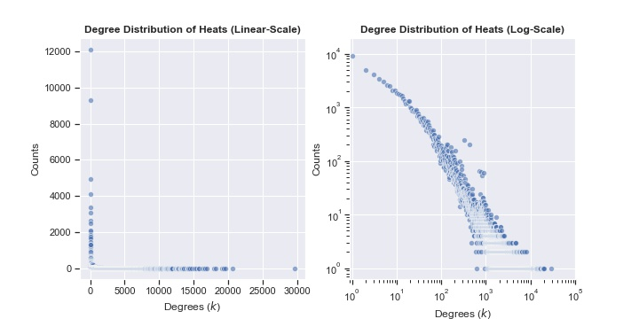

# Generic Summary of Unipartite Graph **Heats**
---
Created: 10/11/21
Computation Time: 69.11sec

## Basic Statistics
---
| Network Statistics | Results |
|---|---|
| Number of Nodes | 120867 |
| Number of Edges | 11058181 |
| Global Density | 0.15% |
## Degree Statistics
---
| Network Statistics | Results |
|---|---|
| Average Degree | 182.98 |
| Five-Number-Summary Degrees | [    0.     3.    19.    82. 29649.] |
## Clustering Statistics
---
| Network Statistics | Results |
|---|---|
| Average LCC | None |
| Five-Number-Summary LCC | None |
## Connected Components Statistics
---
| Network Statistics | Results |
|---|---|
| Number of CC | 15067 |
| Average CC Size | 8.02 |
| Five-Number-Summary of CC Sizes | [    1.     1.     1.     1. 99907.] |
| Average CC Density | None |
| Five-Number-Summary of CC Densities | None |
## Centrality Statistics
---
| Network Statistics | Results |
|---|---|
| Degree Centrality | ['r17', 'r302', 'r616', 'r654', 'r8', 'r76', 'r58', 'r518', 'r508', 'r84'] |
| Betweenness Centrality | None |
## Degree Distribution Plot
---
