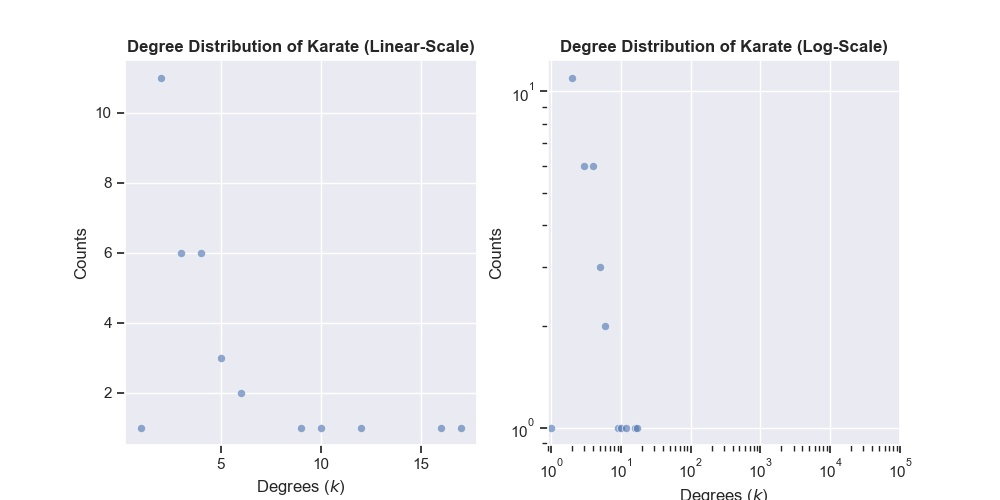

# Generic Summary of Unipartite Graph **Karate**
---
Created: 09/11/21
Computation Time: 0.57sec

## Basic Statistics
---
<table>
<tr><th align="center">
<small>Network Statistic</small>
</th><th align="center">
<small>Result</small>
</th></tr>
<tr><td>Number of Nodes</td><td>34</td></tr>
<tr><td>Number of Edges</td><td>78</td></tr>
<tr><td>Global Density</td><td>13.9%</td></tr>
</table>

## Degree Statistics
---
<table>
<tr><th align="center">
<small>Network Statistic</small>
</th><th align="center">
<small>Result</small>
</th></tr>
<tr><td>Average Degree</td><td>4.59</td></tr>
<tr><td>Five-Number-Summary Degrees</td><td>[ 1.  2.  3.  5. 17.]</td></tr>
</table>

## Clustering Statistics
---
<table>
<tr><th align="center">
<small>Network Statistic</small>
</th><th align="center">
<small>Result</small>
</th></tr>
<tr><td>Average LCC</td><td>0.57</td></tr>
<tr><td>Five-Number-Summary LCC</td><td>[0.         0.33333333 0.5        1.         1.        ]</td></tr>
</table>

## Connected Components Statistics
---
<table>
<tr><th align="center">
<small>Network Statistic</small>
</th><th align="center">
<small>Result</small>
</th></tr>
<tr><td>Number of CC</td><td>1</td></tr>
<tr><td>Average CC Size</td><td>34.0</td></tr>
<tr><td>Five-Number-Summary of CC Sizes</td><td>[34. 34. 34. 34. 34.]</td></tr>
<tr><td>Average CC Density</td><td>0.13903743315508021</td></tr>
<tr><td>Five-Number-Summary of CC Densities</td><td>[0.13903743 0.13903743 0.13903743 0.13903743 0.13903743]</td></tr>
</table>

## Centrality Statistics
---
<table>
<tr><th align="center">
<small>Network Statistic</small>
</th><th align="center">
<small>Result</small>
</th></tr>
<tr><td>Degree Centrality</td><td>[33, 0, 32, 2, 1, 3, 31, 8, 13, 23]</td></tr>
<tr><td>Betweenness Centrality</td><td>[0, 33, 32, 2, 31, 8, 1, 13, 19, 5]</td></tr>
</table>

## Degree Distribution Plot
---
