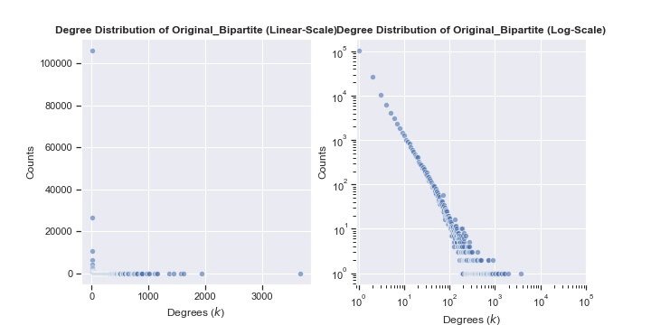

# Generic Summary of Unipartite Graph **Original_Bipartite**
---
Created: 10/11/21
Computation Time: 35.95sec

## Basic Statistics
---
| Network Statistics | Results |
|---|---|
| Number of Nodes | 177386 |
| Number of Edges | 440237 |
| Global Density | 0.0% |
## Degree Statistics
---
| Network Statistics | Results |
|---|---|
| Average Degree | 4.96 |
| Five-Number-Summary Degrees | [   1.    1.    1.    3. 3675.] |
## Clustering Statistics
---
| Network Statistics | Results |
|---|---|
| Average LCC | None |
| Five-Number-Summary LCC | None |
## Connected Components Statistics
---
| Network Statistics | Results |
|---|---|
| Number of CC | 15067 |
| Average CC Size | 11.77 |
| Five-Number-Summary of CC Sizes | [     2.      2.      2.      2. 139752.] |
| Average CC Density | 0.9007142597097195 |
| Five-Number-Summary of CC Densities | [0.00004274 1.         1.         1.         1.        ] |
## Centrality Statistics
---
| Network Statistics | Results |
|---|---|
| Degree Centrality | ['r17', 'r302', 'r654', 'r76', 'r616', 'r58', 'r8', 'r866', 'r84', 'r29'] |
| Betweenness Centrality | None |
## Degree Distribution Plot
---
